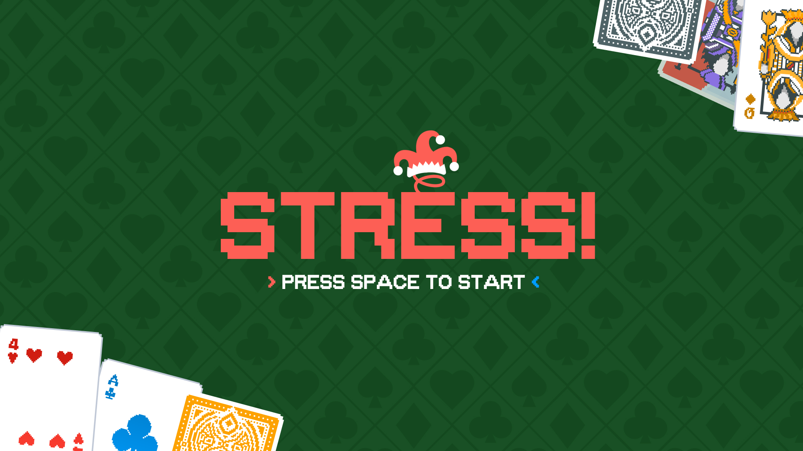

# CS102-CardGameProject-G4T7



Welcome to **Stress! The Game**: A local multiplayer videogame rendition of the classic card game Stress, combining the fast pace nature of the original game with the visual appeal of a videogame.

Challenge a friend (or foe!) to this quick battle of wits and strategy, and remember, speed is the name of the game!

## Rules

**Objective**: Clear all your cards as fast as possible.

**Stress! The Game** uses a slightly different ruleset from the original card game [Stress](https://www.wikihow.com/Play-Stress-(Card-Game)). 

As per the original rules, each player will start with 26 cards (half of a standard pack of cards), with one card being placed on different piles to start.

On top of stacking consecutive cards in ascending or descending order, our game adds a new twist: **cards can be stacked if both cards have the same rank**! This provides more opportunities for players to interrupt the flow of the game and disrupt their opponent, while making them consider their card choices wisely.

The highlight of the game is **calling Stress!**—a fast-paced challenge that keeps players on their toes. When *both piles show cards of the same rank*, either player can call Stress! The slower player must collect all the cards from both piles and add them to their deck, putting them at a disadvantage. 

## Controls
| **Player**  | **Action**                             | **Control Keys**          |
|-------------|----------------------------------------|---------------------------|
| **Player 1**| Throw card from HAND to a PILE         | `Q`, `W`, `E`, `R`        |
|             | Select Target Pile                  | `A`, `D`                  |
|             | Call Stress!                           | `S`                       |
| **Player 2**| Throw card from HAND to a PILE         | `U`, `I`, `O`, `P`        |
|             | Select Target Pile                  | `J`, `L`                  |
|             | Call Stress!                           | `K`                       |

To combat button mashing, players are penalised for incorrect moves, with their controls going on cooldown for:  
* 1 second (on an invalid card throw)  
* 2 seconds (on an invalid stress call)  

**Be quick, but accurate!**

## Running Stress! The Game

### Step 1: Determine Your Operating System
- **Windows Users**: Use the `.bat` files.
- **macOS/Linux Users**: Use the `.sh` files.

---

#### For Windows Users
1. Compile the source files:
```
./compile.bat
```
2. Run the game
```
./run.bat
```
---

#### For macOS/Linux Users
1. Make the `.sh` scripts executable (if not already):
```
chmod +x compile.sh run.sh
```
2. Compile the source files:
```
./compile.sh
```
3. Run the game:
```
./run.sh
```
---

### Step 2: Play the Game
1. Follow the on-screen instructions.
2. **Have fun!** (Turn on the sound for a better experience.)
3. Press `ESC` to quit the game, or `S + K` to restart and play again.

## Game Conditions
The following game conditions can happen in Stress! The Game:
1. **Timeout:** Both players have no valid cards (that can be placed on the pile) in their hand. Pressing S + K reshuffles the players' cards to continue the game.
2. **Win:** Either player one or player two has 0 cards in both their hand and their deck.
3. **Tie:** Both players are out of valid card places, but there are no more cards left in the deck.

## Group Members
1. KAUNG SET LIN, slkaung.2023
2. ZANE CHEE JUN YI, zane.chee.2023
3. WANG YUFEI, yufei.wang.2023
4. LEONG HWEE MEL BRIDGETTE, hmb.leong.2023
5. KWAN RUI CONG, ruicongkawn.2023
6. YEO SHEEN HERN, sh.yeo.2023