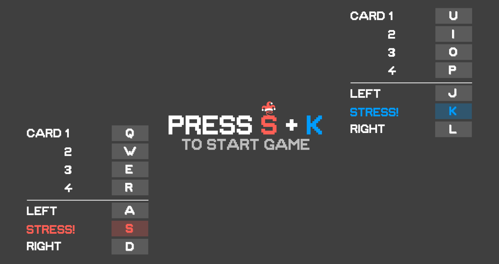

# CS102-CardGameProject-G4T7


Welcome to **Stress! The Game**: A local multiplayer videogame rendition of the classic card game Stress, combining the fast pace nature of the original game with the visual appeal of a videogame.

Challenge a friend (or foe!) to this quick battle of wits and strategy, and remember, speed is the name of the game!

--

## Group Members
1. KAUNG SET LIN, slkaung.2023
2. ZANE CHEE JUN YI, zane.chee.2023
3. WANG YUFEI, yufei.wang.2023
4. LEONG HWEE MEL BRIDGETTE, hmb.leong.2023
5. KWAN RUI CONG, ruicongkawn.2023
6. YEO SHEEN HERN, sh.yeo.2023

--

## Terminology
Each player has a hand and a deck, and aim to place their cards on piles.

	HAND (both players): revealed cards that can be played
	DECK (both players): remaining cards unrevealed
	PILE (2): playing cards in the middle

--

## Rules

**Objective**: Clear all your cards as fast as possible.

**Stress! The Game** uses a slightly different ruleset from the original card game [Stress](https://www.wikihow.com/Play-Stress-(Card-Game)). 

As per the original rules, each player will start with 26 cards (half of a standard pack of cards), with one card being placed on different piles to start.

On top of stacking consecutive cards in ascending or descending order, our game adds a new twist: **cards can be stacked if both cards have the same rank**! This provides more opportunities for players to interrupt the flow of the game and disrupt their opponent, while making them consider their card choices wisely.

Stress! can be called by either player when both cards on the piles are identical in rank. The other player that is too slow to the call will have to taken all the cards from the pile and place it in their deck.

--

## Controls

Inspired by the QWER control scheme of real time strategy (RTS) games, and the classic WASD control scheme of most shooter games, we chose to offer players the best of both worlds. 
Use QWER (or UIOP for player two) to throw your cards from your HAND to one of the PILEs.
Use AD (or JL) to switch between PILEs. 

**Most importantly, S (or K) is used to called Stress!**



To combat button mashing, players are penalised for incorrect moves, with their controls going on cooldown for:
1 second (on an invalid card throw)
2 seconds (on an invalid stress call)
Be quick, but accurate!

--

## Running Stress! The Game

1. Compile the source files
```
./compile.bat
```
2. Run the game
```
./run.bat
```
3. Follow the on-screen instructions
4. Remember to have fun! (turn on the sound)
5. Press ESC to quit the game, or S + K to go again

--

## Game Conditions
The following game conditions can happen in Stress! The Game:
1. **Timeout:** Both players have no valid cards (that can be placed on the pile) in their hand. Pressing S + K reshuffles the players' cards to continue the game.
2. **Win:** Either player one or player two has 0 cards in both their hand and their deck.
3. **Tie:** Both players are out of valid card places, but there are no more cards left in the deck.

--